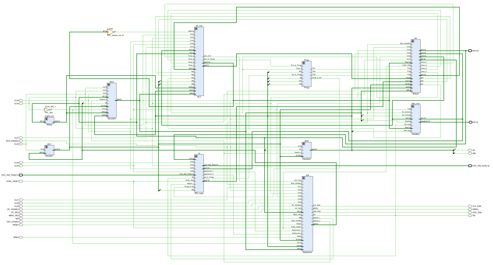

# SM83 HDL

All elements of the SM83 circuitry made as Verilog.

:warning: The schematics may lag and diverge slightly from the main section (wiki), but the differences are minimal and will settle in time.
