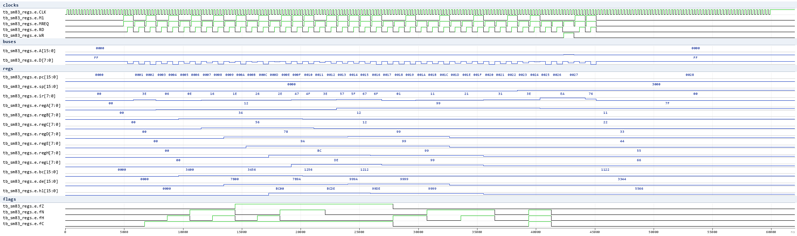
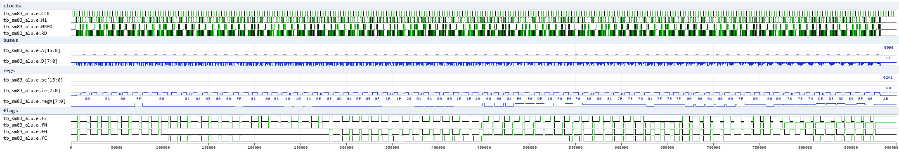
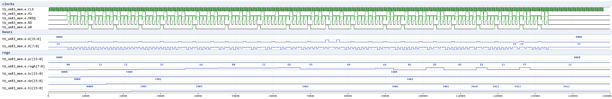
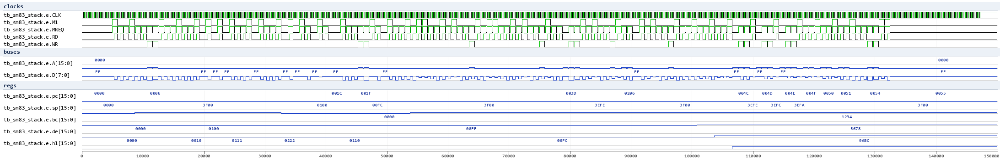
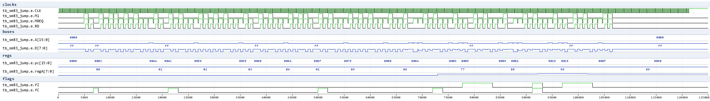
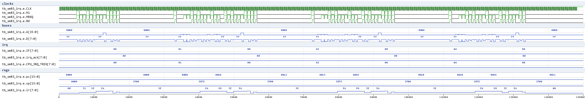
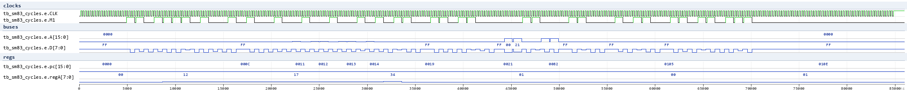

# SM83 waves (issue #400)

Waveform documentation for the SM83-core regression suite
(`HDL/sm83/Icarus`), rendered from the test VCDs with `vcd2png.py`
(Pillow; `.gtkw` v3.3.128 save files sit next to each test).  All checks
below run on the **real SM83 core netlist** (`HDL/sm83/Top.v` SM83Core +
the module files), clocked by `external_clk.v` with a flat-memory model
(`sm83_env.v`).

Signal legend (env probes, all under `tb_sm83_*.e.`):
- `CLK` - the ~4.19 MHz oscillator; `M1` - opcode-fetch pulse of the
  sequencer; `MREQ`/`RD`/`WR` - external bus strobes
- `A[15:0]`/`D[7:0]` - address/data buses
- `pc`, `sp`, `ir` - program counter / stack pointer / opcode register
- `regA..regL`, `bc`/`de`/`hl` - the register file (hierarchical probes
  into `dmgcore.bot.regs`), `fZ/fN/fH/fC` - flags (zbus bits 7:4)

## tb_sm83_regs - register file / immediate loads

Program: 8-bit immediates, register moves, BC/DE/HL pair loads, SP load and
a `LD (nn),A` store, then HALT.  Wave shows PC stepping through the code
while A/B/C/D/E/H/L/BC/DE/HL/SP settle to their loaded values; the final
`LD (2000),A` store is visible as a WR bus cycle on `A=2000, D=7F`.

Verified (13 checks): every register/pair value + the memory store + PC at
HALT.  This is the register-file/load-group regression.

## tb_sm83_alu - 8-bit ALU + flags

Straight-line program executing ADD/ADC/SUB/SBC/AND/OR/XOR/CP (immediate
forms) over 8 operand pairs (80 cases, 160 checks).  Each case stores the
result A and the flags F (via PUSH AF) to its own stack cells.  The wave
shows the bus cycles (PC, opcode fetch on M1, operand bytes) and the
`regA`/flag trajectory across the cases.

Verified: A result + Z/N/H/C flag law for all 80 cases - the ALU + flag
register regression (the "what flags does op X set" oracle).

## tb_sm83_mem - memory addressing modes

LD (BC)/(DE)/(HL),A / LD A,(BC)/(DE)/(HL), LD (HL),n, LD A,(nn), LD (nn),A,
LDH (n8),A/LDH A,(n8), HLI/HLD auto-increment/decrement (both load and
store directions).  Each op writes its observable result to a dedicated
cell; 18 checks.

## tb_sm83_stack - 16-bit moves / stack / control flow

LD rr,nn, PUSH/POP rr (incl. AF), 16-bit INC/DEC, ADD HL,rr, ADD SP,e,
LD HL,SP+e, LD (nn),SP, CALL/RET, JP cc.  Subroutines at fixed addresses
($0080/$0150) are reached only through absolute CALL/JP targets; markers
stamp each taken/not-taken path (15 checks).  The wave shows SP sliding
down on pushes and the stack roundtrip.

## tb_sm83_jump - conditional relative jumps + RST

JR NZ/Z/NC/C taken and not-taken paths + RST 08/18 with the vector-page
handlers and the return-address push/pop (11 checks).  Boot JR skips the
RST pages at $0008/$0018.

## tb_sm83_irq - interrupt dispatch (IE/IME/IF, HALT wake)

Three phases on one boot: IE = VBlank/EI/HALT, then the test asserts IF
bit0 -> the core wakes, pushes PC, clears IF via CPU_IRQ_ACK and vectors
to $40; handler stores 0x5A and RETIs.  Phases 2/3 do the same for
LCDSTAT ($48) and Timer ($50).  IE lives inside the core ($FFFF write);
IF is the env model (source set, ack-cleared) like the SoC MMIO.

Verified (8 checks): all three handlers ran, IF cleared after each ACK, SP
returned to $3F00 after RETI, final PC at the end HALT.

## tb_sm83_cycles - instruction T-state timing

Measures each executed instruction's duration as the CLK periods between
successive M1 rising edges and compares to the documented SM83 cycle
counts (32 checks): NOP 4, LD r,n 8, LD r,r 4, INC/DEC 4, ADD A,n 8,
LD rr,nn 12, ADD HL,rr 8, LD (HL),n 12, LD A,(HL) 8, INC/DEC (HL) 12,
JR taken 12 / not-taken 8, CALL 24, RET 16, JP 16.

Verified: all 32 measured intervals equal the documented values - the SM83
timing oracle for the netlist (add a candidate opcode between two M1s and
its measured duration answers "how many cycles does it take").
