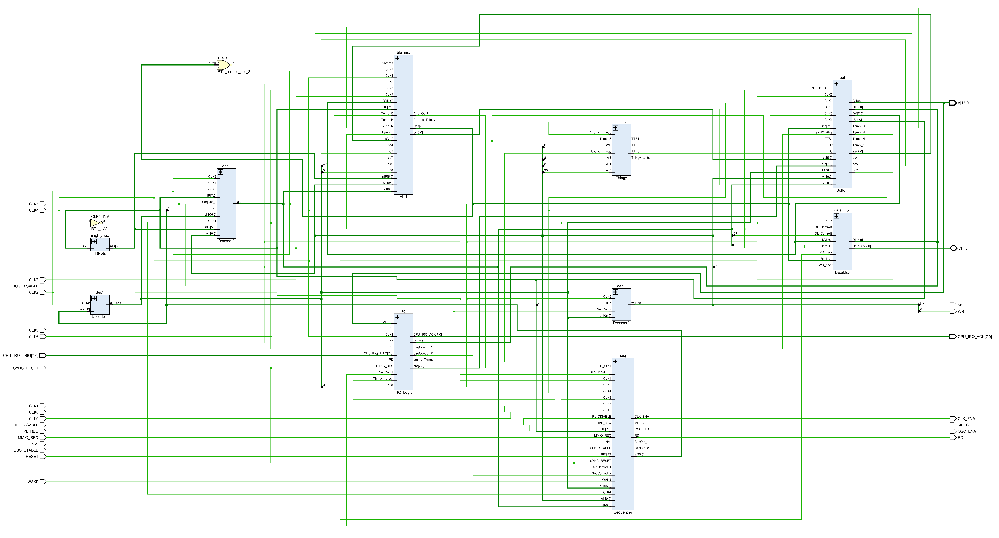

# SM83 Core HDL

All elements of the SM83 core circuitry made as Verilog.

:warning: The schematics may lag and diverge slightly from the main section (wiki), but the differences are minimal and will settle in time.

Among other things, this verilog requires thoughtful reading and checking against the description of the schematics on the wiki so that everything is authentic.
