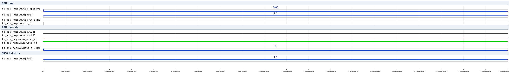
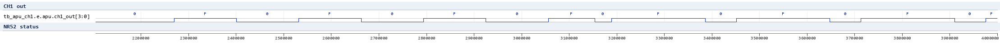
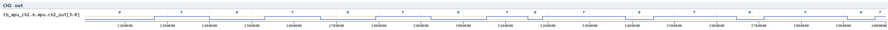
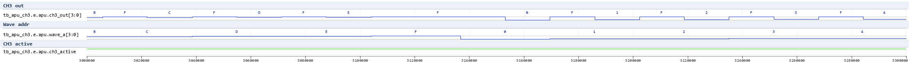
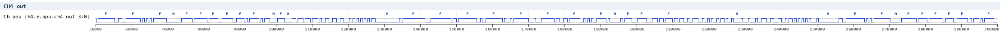
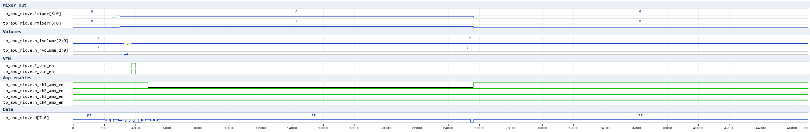

# APU waves (issue #398)

Waveform documentation for the APU suite (`HDL/soc/icarus/apu`), rendered
from the test VCDs with `vcd2png.py` (Pillow; `.gtkw` v3.3.128 save files
sit next to each test). All timing facts below were measured on the real
APU netlist (`apu_wc.v`, see Readme.md/STATUS.md).

## tb_apu_regs - register file

CPU write/read cycles to $FF10-$FF2F + the wave-RAM window $FF30-$FF3F.
Shown: the address/data bus, the `soc_wr`-derived decode (`w188`), the
wave-RAM window decode `w695` and the `n_wave_wr`/`n_wave_rd` strobes.

Verified facts:
- register read-back masks (NR10 = 0x80|v, NR11 = 0x3F|(v&0xC0), NR14 =
  0xBF|(v&0x40), ...; NR52 = 0x70|(power<<7)|status); freq-lo registers
  (NR13/NR23/NR33) have no read-back (0xFF on read).
- $FF30-$FF3F accesses are decoded inside the APU (`w695` window).

## tb_apu_ch1 - channel 1 square

Two duty segments (50% then 75%, X=0x780): the square high interval is
1/2 (then 3/4) of the 262.144 us output period.

Verified facts:
- output period = (2048-X)*32 osc = 262144 ns at X=0x780 (duty cycle
  table exact: 12.5/25/50/75%).
- high level = NR12 volume; NR52 status bit0 tracks the channel.

## tb_apu_ch2 - channel 2 square

Same structure as ch1 (no sweep) - works only with the w548 bus-model fix
(`apu_wc.v`), see STATUS.md for the root cause.

## tb_apu_ch3 - channel 3 wave

Vol-100% segment with a known wave-RAM image: `ch3_out` sits at the
sample value F while `ch3_active`/`wave_a` step the RAM at
(2048-X)*2 osc per sample (X=0x7F0 -> ~2 us/step in this window).

Verified facts:
- amplitude = sample scaled by NR32 (100/50/25%/mute measured);
- sample rate = 2^21/(2048-X) (steps measured 8x between X=0x7F0 and
  X=0x780).

## tb_apu_ch4 - channel 4 noise

LFSR output at NR43 divisor 0, 15-bit width: the level toggles between 0
and F (NR42 volume) - a pseudo-random pattern, not a square.

## tb_apu_mix - mixer / volume / DAC enables

CPU writes to NR51/NR50/NR52 while the mixer outputs (lmixer/rmixer,
n_lvolume/n_rvolume, vin, n_ch*_amp_en) are probed.

Verified facts:
- NR51 low nibble -> right (SO1) mixer, high nibble -> left (SO2);
- NR50 volumes appear inverted on n_lvolume/n_rvolume; bits 7/3 -> vin;
- n_ch*_amp_en follow the channel running / NR52 power state.
