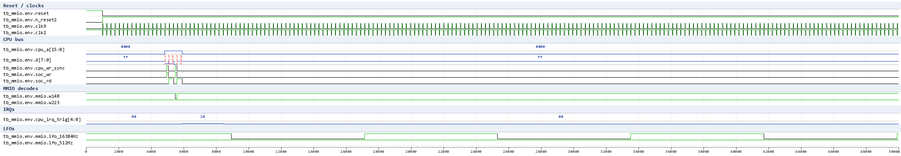
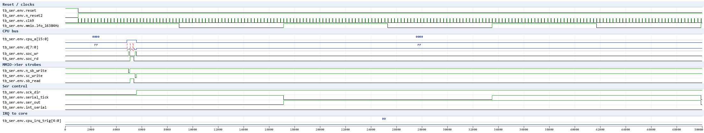
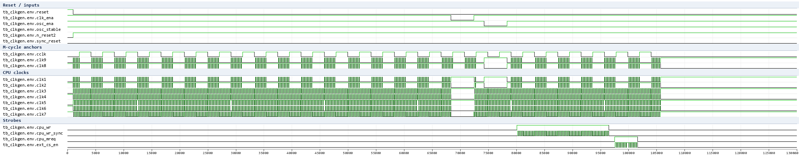
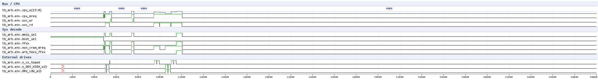
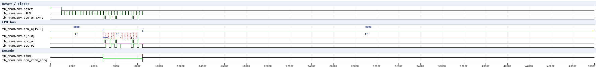
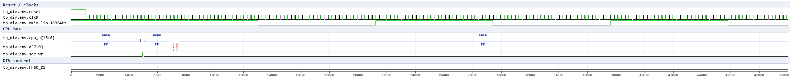
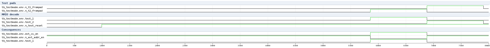

# SoC small-domain waves (issue #396)

Waveform documentation for the SoC small-domain testbench suite
(`HDL/soc/icarus/soc`): ClkGen, Arbiter, MMIO, Ser (+ HRAM). Generated
with the WSL-native Icarus + the `vcd2png.py` renderer (the GTKWave
v3.3.128 save files are committed next to each test).

## tb_mmio - MMIO register behaviour

Reset, TIMA/TAC/TMA write->read roundtrips, IF flag set/clear and the
lfo_16384Hz (= clk9/64) divider.

What to look at in the wave:

- `reset` deassert -> `n_reset2`/`sync_reset` settle after a few clock
  edges (ClkGen reset synchronizer).
- CPU cycles: address on `cpu_a`, `d` carries the data; `cpu_wr_sync`
  pulses = MMIO `soc_wr` write windows; the decode clocks (`w148` =
  $FF07/TAC write, `w223` = $FF06/TMA write) are low inside the window
  and capture their dffs on the trailing edge.
- `cpu_irq_trig` bit4 pulses after the `int_jp` strobe (IF joypad flag)
  and clears after the CPU IRQ acknowledge.
- `lfo_16384Hz`: 64 toggles per 4096 `clk9` cycles (clk9 / 64).

## tb_ser - Serial link

SB load, SC start with the internal shift clock, 8-tick transfer,
`int_serial` on completion, SC start-bit auto-clear, IF serial flag.

Verified behaviour:
- `sck_dir` = SC bit0 (internal clock master when 1).
- Writing SC bit7 = 1 starts an 8-tick transfer; `serial_tick` pulses 8
  times; SB shifts out on `ser_out` and in from `n_sin` (idle high -> all
  ones after the transfer).
- On completion `int_serial` rises, the MMIO IF serial flag
  (`cpu_irq_trig[3]`) is set, and the SC start bit self-clears.
- IF serial flag is cleared by the CPU IRQ acknowledge.
- SB read-back of an arbitrary loaded value shows only bus-bit0 (read-back
  polarity/order open question - the loaded value is proven through the
  shift result).

## tb_clkgen - ClkGen

Reset synchronizer, clk_ena/osc_ena gating and the phase structure of the
nine clock outputs.

Verified behaviour (tb_clkgen PASS + clkgen_phases.py table):
- M-cycle = 4 oscillator cycles (256 ns at the test frequency); clk1/clk3/
  clk5/clk9 rise at T0, clk2/clk8 at +1 osc, clk4 at +2, clk6/clk7 at +3;
  cclk follows the oscillator.
- clk_ena stops clk1..clk7 while clk9 keeps running; osc_ena stops the
  whole tree; cpu_wr_sync pulses once per M-cycle; ext_cs_en is an
  active-low per-M-cycle pulse while cpu_mreq is high.

## tb_arb - Arbiter Sys Decode + BANK

Address-decode sweep of mmio_sel/boot_sel/ffxx/non_vram_mreq/
arb_fexx_ffxx, the $FF50 BANK register disabling the internal boot ROM,
and the VRAM-window definition of non_vram_mreq.

Verified behaviour (tb_arb PASS):
- `boot_sel` = 1 for $0000-$00FF (with the BANK register clear), else 0.
- `ffxx` = 1 for $FFxx; `mmio_sel` = 1 for $FE00+ (FExx/FFxx window).
- `non_vram_mreq` = MREQ & not the $8000-$9FFF VRAM window.
- writing $FF50 = 1 disables the internal boot ROM (boot_sel goes 0) and
  is sticky (writing $FF50 = 0 does not re-enable it).

## tb_hram - HRAM (behavioral model)

Roundtrips through the real MMIO/Arb decode into the behavioral
`hram_model.v` (the real macro's storage cells are TBD stubs in sram.v).

Verified (tb_hram PASS, compiled with -DNO_SER):
- writes/reads at $FF80/$FFC0/$FFFE round-trip; neighbouring cells stay
  independent; rewriting a cell to 0 works; $FFFF (IE) is outside the
  HRAM window (the netlist decode excludes a[6:0] = 0x7F) so a write
  there does not touch the RAM.
- the model captures on the `soc_wr` falling edge (same point as the MMIO
  register decode clocks) and mirrors the netlist's window decode
  ffxx & a[7] & (a[6:0] != 0x7F).

## tb_div - DIV counter

DIV reset-to-zero on a $FF04 write, clean read-back (mmio_weakbus.v),
counting at the lfo rate, 8-bit wrap, and the FF60_D1 fast mode probe.

Verified (tb_div PASS):
- after the $FF04 write DIV reads ~0, then counts one per lfo cycle
  (0x80 after 128 lfo cycles) and wraps at 256.
- FF60_D1 = 1 (TEST_PAD.1, DIV clocked by clk9): read ~0x0C in the
  window - clk9-driven, exact source taps under analysis.

## tb_testmode - TEST1/TEST2 decode

Pad decode of the test pins through the real MMIO test-mode logic.

Verified (tb_testmode PASS):
- TEST1 (T2 pad low, T1 high): `test_1` asserts, `test_2` off;
  `ext_cs_en` is forced high and `n_ext_addr_en` asserts (external
  address enable) - the internal CPU A/D bus drivers are disabled.
- TEST2 (T1 pad low, T2 high): `test_2` asserts, `test_1` off.
- both pads high (normal) -> both test modes off.

## Open / upcoming tests

- external /CS pad semantics need a pad + external-memory model (netlist:
  n_cs asserts for the a15&(a13|a14) & ~(a[15:10]=111111) windows with
  ext_cs_en, i.e. A000-BFFF / C000-FBFF, not the $0000-7FFF ROM region)
- Ser d[6] bus modelling (see STATUS.md), TEST1 mode bus driving,
  DIV read-back modelling

See [Readme.md](Readme.md) for status and [STATUS.md](STATUS.md) for the
research log.
