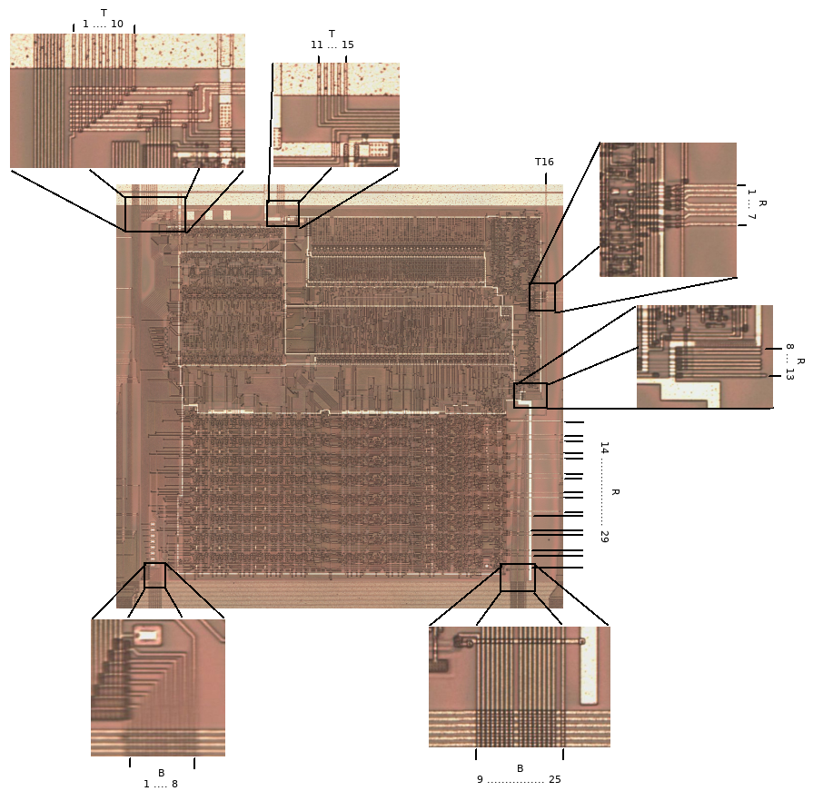

# DMG-CPU SM83 Core Connections

By @msinger: http://iceboy.a-singer.de/doc/dmg_cpu_connections.html

|N|I/O|Wire|Cell|Description|
|---|---|---|---|---|
|T1	|O	|FROM_CPU6	|LEXY.in	|The output of the inverter LEXY ends at an output pad at the bottom of the die, which is not bonded.|
|T2	|I	|TO_CPU	|BOWA.q	|A gated 1 MiHz clock. The CPU can stop this clock by driving T11 or T14 low. This is the inverse of T3.|
|T3	|I	|unlabeled	|BEDO.q	|A gated 1 MiHz clock. The CPU can stop this clock by driving T11 or T14 low. This is the inverse of T2.|
|T4	|I	|unlabeled	|BEKO.q, BAVY.q	|A gated 1 MiHz clock. The CPU can stop this clock by driving T11 low. This is the inverse of T5.|
|T5	|I	|PHI_OUT	|BUDE.q, BEVA.q	|A gated 1 MiHz clock. This is the inverse of the clock that comes out of the PHI pin of the chip. (PHI_OUT is connected to the output buffer of the PHI pin, but the output buffer is inverting.) The CPU can stop this clock by driving T11 low. This is the inverse of T4.|
|T6	|I	|unlabeled	|BOLO.q, BYDA.q	|A gated 1 MiHz clock. The CPU can stop this clock by driving T11 low. This is the inverse of T7.|
|T7	|I	|FROM_CPU5	|BUFA.q, BYLY.q	|:warning: _NOTE: The label used in the schematics is misleading. This is not FROM CPU;_ it is TO CPU! A gated 1 MiHz clock. The CPU can stop this clock by driving T11 low. This is the inverse of T6.|
|T8	|I	|unlabeled	|BUKE.q	|A gated 1 MiHz clock. The CPU can stop this clock by driving T11 low.|
|T9	|I	|unlabeled	|BOMA.q	|A gated 1 MiHz clock. The CPU can stop this clock by driving T14 low. This is the inverse of T10.|
|T10	|I	|BOGA1MHZ	|BOGA.q	|A gated 1 MiHz clock. The CPU can stop this clock by driving T14 low. This is the inverse of T9.|
|T11	|O	|CLK_FROM_CPU	|ABOL.in, TUBO.in1	|:warning: _NOTE: The label used in the schematics is misleading. This is not a clock!_ CPU can drive this low to disable most of the clocks fed to itself. T9 and T10 are the only clocks that are not turned off when this signal gets driven low. However, T9 and T10 might have slightly shorter "shorter" phases while this signal is high. By "shorter" phases I mean, they are not symetric and have a shorter and a longer phase (and the shorter one gets even shorter). This is because of BUTO mixing them with the other clocks when they're active. Maybe they did this to guarantee a specific synchronicity between T9/T10 and the other clocks that tick at around the same time as T9/T10. The initial state (during and directly after reset) of T11 must be low. The CPU must NOT switch this signal to high immediately after reset, otherwise the synchronous CPU reset T12 (AFER) and the synchronous peripheral resets (RESET2, RESET6, RESET7, ...) will never be deasserted. The CPU must wait until T15 (TABA) gets high. This happens when the DIV register is half run through, which takes about 32 milliseconds. Then the CPU can pull T11 high, which deasserts the synchronous CPU and peripheral resets one T9/T10 tick later. Wether the CPU pulls T11 high immediately when T15 gets high or if it delays that by a T9/T10 tick is unknown (both will work fine). I assume this mechanism is there to assure the crystal oscillator is stabilized. The same mechanism likely is used when the system wakes up from STOP mode. When the crystal oscillator gets disabled by driving T14 low, the DIV register gets reset to zero, so it will take the same ~32 ms. For this mechanism to work, many of the bugs in the schematics must be fixed, especially #29, #10 and #43. When the CPU executes a HALT instruction and none of the enabled interrupts are pending, then the CPU will pull T11 low to disable most of its clocks. When waking up from HALT mode (due to an interrupt), the CPU will pull T11 high on the next T9/T10 tick, which re-enables all the other clocks.|
|T12	|I	|unlabeled	|AFER.q	|Active-high synchronous reset input. Synchronized to T9/T10.|
|T13	|I	|RESET	|RST (ext. pad)	|Active-high asynchronous reset input. Fed directly from RST input pad.|
|T14	|O	|CLKIN_A	|multiple	|:warning: _NOTE: The label used in the schematics is misleading. This is not a clock;_ nor is it an input! Crystal oscillator enable. When CPU drives this low, the crystal oscillator gets disabled to save power. This happens during STOP mode.|
|T15	|I	|unlabeled	|TABA.q	|Active-high crystal oscillator stablilized input? After reset, this signal gets high after about 32 milliseconds. The CPU must not drive T11 high before T15 gets high. See description of T11.|
|T16	|I	|unlabeled	|(ext. pad)	|Directly connected to an input pad at the top of the die, which is not bonded.|
|R1	|O	|CPU_RAW_RD	|multiple	|Active-high memory RD signal from CPU.|
|R2	|O	|FROM_CPU3	|multiple	|Active-high memory WR signal from CPU.|
|R3	|I	|T1T2	|UNOR.q	|Maybe used to disable all bus drivers in the CPU when test mode is active.|
|R4	|I	|unlabeled	|SYRO.q	|High when address bus is 0xfexx or 0xffxx. When high, it suppresses R7, so that the data bus can be driven by an internal component (HRAM, OAM, FFxx registers). I suspect this is also used by the CPU to decode the address for the interrupt enable register (0xffff), but I'm not sure yet.|
|R5	|I	|unlabeled	|TUTU.q	|High when address bus is 0x00xx and boot ROM is still visible. When high, it suppresses R7, so that the data bus can be driven by the internal boot ROM.|
|R6	|I	|T1T2	|UMUT.q	|Maybe used to disable all bus drivers in the CPU when test mode is active.|
|R7	|O	|FROM_CPU4	|TEXO.in1, AGUT.in3	|Active-high external memory request. Has to be high during external memory cycles (read or write). This causes one of the chip select signals (CS, MCS, A15) to be asserted in the right moment. Has to be low if no memory cycle is going on, otherwise the chip select will be asserted even if R1 and R2 are low. During write cycles, this signal is also needed for driving the internal data bus onto the I/O pads. During read cycles, this signal is also needed for latching the I/O pads and driving the latched data onto the internal data bus. When R4 or R5 is high, the CPU keeps this signal low, allowing internal components (HRAM, OAM, boot ROM, FFxx registers) to drive the internal data bus.|
|R8	|?	|-	|-	|Not connected.|
|R9	|?	|-	|-	|Not connected.|
|R10	|?	|-	|-	|Not connected.|
|R11	|?	|-	|-	|Not connected.|
|R12	|?	|-	|-	|Not connected.|
|R13	|?	|-	|-	|Not connected.|
|R14	|O	|CPU_IRQ0_ACK	|LETY.in	|Active-high. Acknowledges IRQ0 (V-Blank).|
|R15	|I	|CPU_IRQ0_TRIG	|LOPE.q	|Active-high. Triggers IRQ0 (V-Blank).|
|R16	|O	|CPU_IRQ1_ACK	|LEJA.in	|Active-high. Acknowledges IRQ1 (Status).|
|R17	|I	|CPU_IRQ1_TRIG	|LALU.q	|Active-high. Triggers IRQ1 (Status).|
|R18	|O	|CPU_IRQ2_ACK	|LESA.in	|Active-high. Acknowledges IRQ2 (Timer).|
|R19	|I	|CPU_IRQ2_TRIG	|NYBO.q	|Active-high. Triggers IRQ2 (Timer).|
|R20	|O	|CPU_IRQ3_ACK	|LUFE.in	|Active-high. Acknowledges IRQ3 (Serial).|
|R21	|I	|CPU_IRQ3_TRIG	|UBUL.q	|Active-high. Triggers IRQ3 (Serial).|
|R22	|O	|CPU_IRQ4_ACK	|LAMO.in	|Active-high. Acknowledges IRQ4 (Joypad).|
|R23	|I	|CPU_IRQ4_TRIG	|ULAK.q	|Active-high. Triggers IRQ4 (Joypad).|
|R24	|O	|CPU_IRQ5_ACK	|-	|Active-high. Acknowledges IRQ5. Not connected.|
|R25	|I	|CPU_IRQ5_TRIG	|GND	|Active-high. Triggers IRQ5. Hardwired to GND.|
|R26	|O	|CPU_IRQ6_ACK	|-	|Active-high. Acknowledges IRQ6. Not connected.|
|R27	|I	|CPU_IRQ6_TRIG	|GND	|Active-high. Triggers IRQ6. Hardwired to GND.|
|R28	|O	|CPU_IRQ7_ACK	|-	|Active-high. Acknowledges IRQ7. Not connected.|
|R29	|I	|CPU_IRQ7_TRIG	|GND	|Active-high. Triggers IRQ7. Hardwired to GND.|
|B1	|I/O	|D0	|multiple	|Data bus D0.|
|B2	|I/O	|D1	|multiple	|Data bus D1.|
|B3	|I/O	|D2	|multiple	|Data bus D2.|
|B4	|I/O	|D3	|multiple	|Data bus D3.|
|B5	|I/O	|D4	|multiple	|Data bus D4.|
|B6	|I/O	|D5	|multiple	|Data bus D5.|
|B7	|I/O	|D6	|multiple	|Data bus D6.|
|B8	|I/O	|D7	|multiple	|Data bus D7.|
|B9	|O	|A15	|multiple	|Address bus A15.|
|B10	|O	|A14	|multiple	|Address bus A14.|
|B11	|O	|A13	|multiple	|Address bus A13.|
|B12	|O	|A12	|multiple	|Address bus A12.|
|B13	|O	|A11	|multiple	|Address bus A11.|
|B14	|O	|A10	|multiple	|Address bus A10.|
|B15	|O	|A9	|multiple	|Address bus A9.|
|B16	|O	|A8	|multiple	|Address bus A8.|
|B17	|O	|A7	|multiple	|Address bus A7.|
|B18	|O	|A6	|multiple	|Address bus A6.|
|B19	|O	|A5	|multiple	|Address bus A5.|
|B20	|O	|A4	|multiple	|Address bus A4.|
|B21	|O	|A3	|multiple	|Address bus A3.|
|B22	|O	|A2	|multiple	|Address bus A2.|
|B23	|O	|A1	|multiple	|Address bus A1.|
|B24	|O	|A0	|multiple	|Address bus A0.|
|B25	|I	|TO_CPU2	|AWOB.q	|Wakes CPU from STOP mode.|
